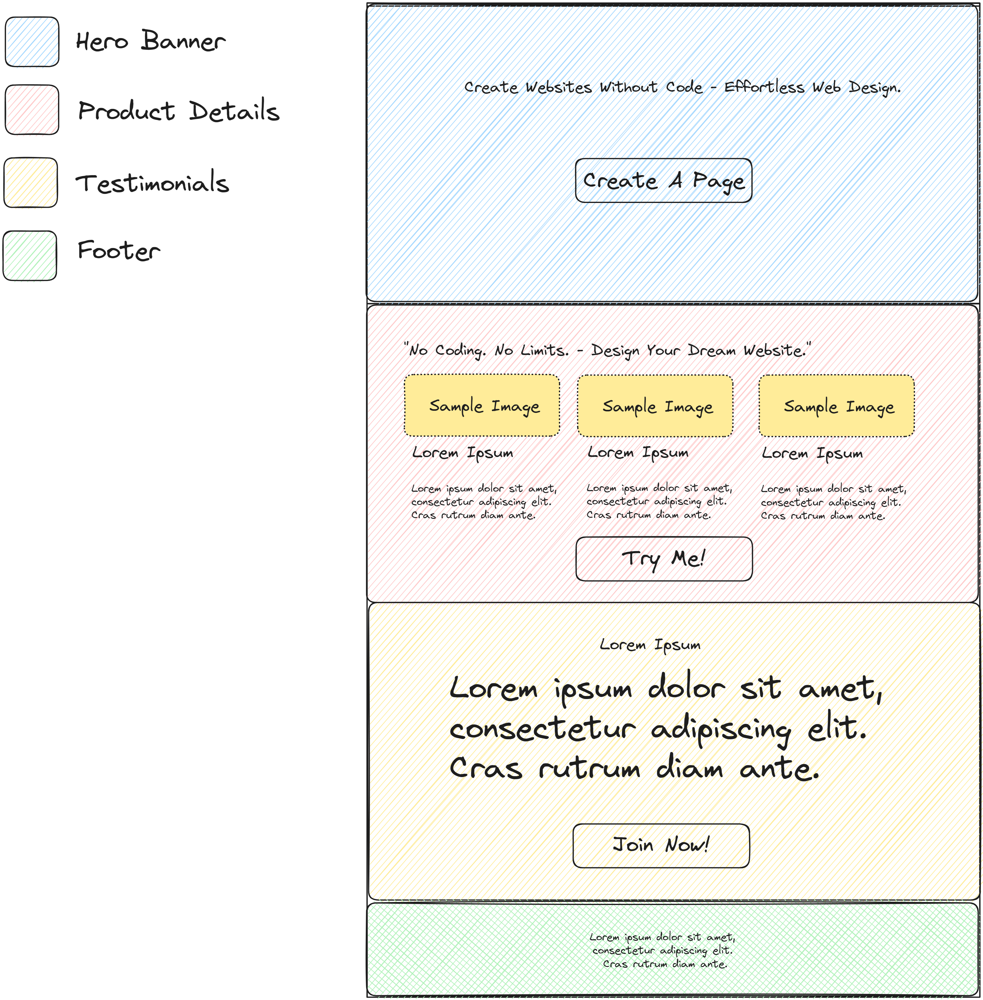

# Marketing Tools Exam
## Specifications
Develop a marketing page using HTML, CSS, and JavaScript that promotes a product, service, or concept of your choice. (The example in the mockup is a no-code platform)

- You may choose any framework/tool that you would like to use.
- Ensure that the page adheres to proper SEO standards and best practices for optimization.
- Utilize proper HTML markup for images and include alt attributes with descriptive text.
- Implement appropriate breakpoints to ensure optimal readability and usability on mobile devices.
- Implement SEO-friendly meta tags, including title, description, and relevant keywords, reflecting the content of the page.
- Break the sections by having background-images / background color per section.
- (optional), You may change the layout/format or items as much as you would like.
- (optional), Host the page in any tool/service that you would prefer. Here are some recommendations that are free of charge.
    - https://vercel.com/
    - https://www.cloudflare.com/ - Cloudflare Pages
    - https://www.netlify.com/

## Mockup
